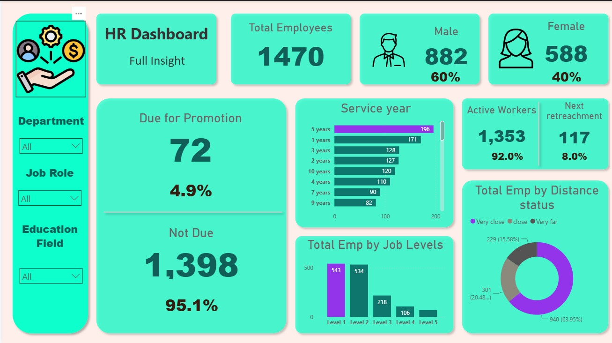

# 👥 HR Analytics Dashboard

## 📌 Overview

This project focuses on analyzing workforce demographics, employee promotion readiness, job levels, service tenure, and workforce retention using Power BI.

The primary objective of this project is to develop an interactive HR Analytics Dashboard that enables HR teams and decision-makers to monitor workforce metrics and gain actionable insights into employee distribution and organizational performance.

The project covers the complete dashboard development workflow, including data preparation, data modeling, DAX measure creation, and interactive dashboard design.

---

# 🛠️ Tools Used

* Power BI
* Power Query
* DAX (Data Analysis Expressions)
* CSV Dataset

---

# 📂 Dataset

Dataset Source:

**Data with Decision — HR Analytics Dashboard Tutorial**

The dataset contains employee-related information such as:

* Employee Demographics
* Department
* Job Role
* Education Field
* Gender
* Service Years
* Promotion Status
* Workforce Status
* Distance Status

---

# ⚙️ Project Workflow

## 1. Data Preparation

The HR dataset was imported into Power BI and prepared using Power Query.

Data preparation activities included:

* Data validation
* Data cleaning
* Data formatting
* Handling inconsistent values
* Preparing fields for analysis and reporting

---

## 2. Data Modeling

The dataset was structured to support efficient reporting and dashboard performance.

The modeling process involved:

* Organizing employee-related attributes
* Creating reusable business metrics
* Building calculated measures
* Optimizing report responsiveness

---

## 3. DAX Measure Development

Custom DAX measures were created to support dynamic KPI calculations and workforce analytics.

### Employee Metrics

* Total Employees
* Male Employees
* Female Employees

### Promotion Metrics

* Due for Promotion
* Not Due for Promotion
* Percentage Due for Promotion
* Percentage Not Due for Promotion

### Workforce Metrics

* Active Workers (On Service)
* Retrenched Employees
* Percentage Active Workers
* Percentage Retrenched Employees

These measures dynamically respond to slicers and filters, allowing flexible workforce analysis.

---

## 4. Dashboard Development

An interactive dashboard was developed to visualize workforce insights and support HR decision-making.

Users can explore data through dynamic filtering by:

* Department
* Job Role
* Education Field

---

# 📊 Dashboard Features

## KPI Cards

* Total Employees
* Male Employees
* Female Employees
* Due for Promotion
* Active Workers
* Next Retrenchment

## Visualizations

### Workforce Demographics

* Employee Gender Distribution

### Promotion Analysis

* Due for Promotion vs Not Due for Promotion

### Service Analysis

* Employee Distribution by Service Years

### Workforce Retention

* Active Workers vs Retrenched Employees

### Job Structure Analysis

* Employee Distribution by Job Levels

### Distance Analysis

* Employee Distribution by Distance Status

---

## 🎛️ Interactive Filters

The dashboard includes interactive slicers for:

* Department
* Job Role
* Education Field

---

# 🔍 Key Insights

* The organization consists of **1,470 employees**.
* Male employees represent approximately **60%** of the workforce, while female employees account for **40%**.
* Only **72 employees (4.9%)** are currently eligible for promotion.
* **92%** of employees are categorized as active workers.
* Most employees are concentrated in **Job Level 1** and **Job Level 2** positions.
* The majority of employees belong to the **Very Close** distance category.

---

# 🖼️ Dashboard Preview



---

# 📁 Repository Structure

```text
hr-analytics-dashboard/
│
├── Images/
│   └── Dashboard_preview.png
│
├── Datasets/
│   └── HR Analytics Data.csv
│
├── Dashboard.pbix
│
└── README.md
```

---

# 🚀 Conclusion

This project demonstrates the development of an end-to-end HR Analytics Dashboard using Power BI.

By leveraging data preparation techniques, DAX calculations, and interactive visualizations, the dashboard provides meaningful insights into workforce demographics, promotion readiness, employee tenure, and workforce retention.

The dashboard helps transform raw HR data into actionable information that can support workforce planning and strategic decision-making.

---

# 📚 Skills Demonstrated

* Data Cleaning
* Data Transformation
* Data Modeling
* DAX Calculations
* KPI Development
* Business Intelligence
* Dashboard Design
* Data Visualization
* HR Analytics
* Workforce Analytics

---

# 🎓 Learning Outcomes

Through this project, I gained practical experience in:

* Building interactive dashboards using Power BI
* Creating dynamic KPI measures using DAX
* Designing business-oriented visualizations
* Applying HR analytics concepts
* Transforming workforce data into actionable insights

---

# 👤 Author

**Muhammad Doni Rizqi Fadhilah**

Business Intelligence & Data Analytics Portfolio Project

🔗 LinkedIn:
https://www.linkedin.com/in/muhammad-doni-rizqi-fadhilah-230662309/
